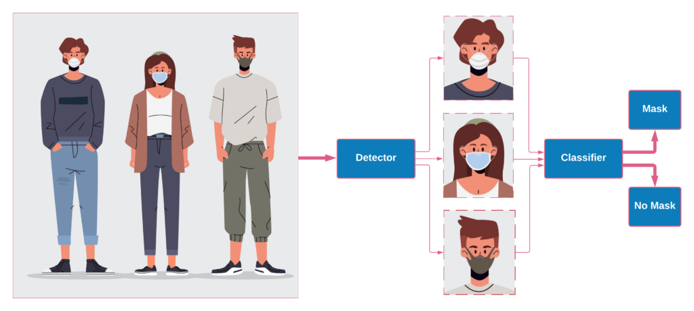
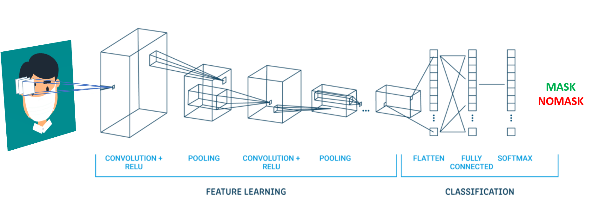
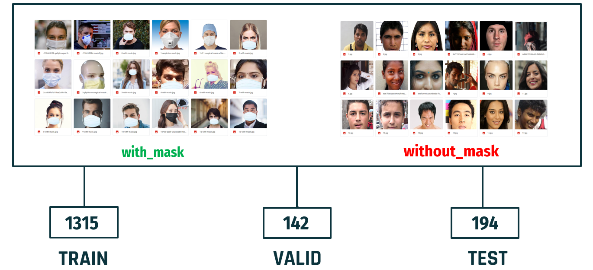

<!-- CAPA -->

<!-- 
<h1 align="center">
    
</h1>
-->

<h2 align="center">
        
<a href="https://colab.research.google.com/drive/1UCvyHJ-dbCfVyzztk6uch3Pf6ZD-9VTm?usp=sharing">
         
</a>
<a href="https://www.youtube.com/watch?v=58JmETGFQZk&t=1057s">
         
</a> 
 
 
 
 
<a href="">
         
</a>
       <a href="https://www.linkedin.com/in/matheusfbonfim/">
         
       </a>  
       
</h2>

<h1 align="center">
    
</h1>


<h1 align="center">
   DETECÇÃO DE MÁSCARA FACIAL 
<h2 align="center">
   REDE NEURAL CONVOLUCIONAL
</h2>
</h1>


<!--INDEX-->
<p align="center">
  <a href="#-sobre-o-projeto">Sobre o projeto</a>&nbsp;&nbsp;&nbsp;|&nbsp;&nbsp;&nbsp;
  <a href="#-detecção-em-tempo-real">Detecção</a>&nbsp;&nbsp;&nbsp;|&nbsp;&nbsp;&nbsp;
  <a href="#-modelo">Modelo</a>&nbsp;&nbsp;&nbsp;|&nbsp;&nbsp;&nbsp;
  <a href="#rocket-tecnologias">Tecnologias</a>&nbsp;&nbsp;&nbsp;|&nbsp;&nbsp;&nbsp;
  <a href="#-tools">Tools</a>&nbsp;&nbsp;&nbsp;|&nbsp;&nbsp;&nbsp;
  <a href="#-como-executar-o-projeto">Como executar o projeto</a>&nbsp;&nbsp;&nbsp;|&nbsp;&nbsp;&nbsp;
  <a href="#memo-license">License</a>
</p>

<h1 align="center">
  
</h1>

<!-- Tópicos -->

## 💻 Sobre o projeto

- Consiste na implementação de um modelo de CNN (Convolutional neural network) para detectar com a utilização da webcam se uma pessoa está usando uma máscara facial ou não.
- Basicamente, o modelo de rede neural convolucional é construído com a utilização do **TensorFlow** em conjunto com a biblioteca **Keras** e **OpenCV**.
- Para construir o modelo, é usado um conjunto de dados de imagens de pessoas com e sem máscaras faciais.
- Toda implementação pode ser vista de forma detalhada no **[Google Colab](https://colab.research.google.com/drive/1UCvyHJ-dbCfVyzztk6uch3Pf6ZD-9VTm?usp=sharing)** e no **[Youtube](https://www.youtube.com/watch?v=58JmETGFQZk&t=786s&ab_channel=MatheusdeFariasBonfim)**.


## 📸 Detecção em tempo real

<h1 align="center">
  
</h1>

## 📃 Modelo 

- A estrutura da implementação é ilustrada na imagem abaixo.
- O modelo construído, compilado e treinado (.h5) pode ser baixado aqui - [Clique aqui para baixar](https://drive.google.com/file/d/1BrqH-ifa6gXy_hco1r0k3pVAVyOjJkdd/view?usp=sharing)

<h1 align="center">
  
</h1>

## :rocket: Tecnologias

This project was developed with the following technologies:

- []()
- [](https://www.tensorflow.org/)
- [](https://opencv.org/)

<!-- - [Expo][expo] -->

## ⛏ Tools


- [](https://colab.research.google.com/drive/1UCvyHJ-dbCfVyzztk6uch3Pf6ZD-9VTm?usp=sharing)
- []()

## 📁 Database

O conjunto de dados (imagens) utilizados pode ser baixado aqui - [Clique aqui para baixar](https://github.com/prajnasb/observations)

Conjunto de dados com **1651 imagens** pertecentes a duas classes 

<h1 align="center">
    
</h1>

## 🔑 Pré-requisitos 

- Todas as dependências e bibliotecas necessárias para executar o projeto estão incluídas no arquivo [requirements.txt](https://github.com/matheusfbonfim/CNN-Face-Mask-Detection/blob/main/requirements.txt)

- O modelo Keras construído, compilado e treinado (.h5) pode ser baixado aqui - [Clique aqui para baixar](https://drive.google.com/file/d/1BrqH-ifa6gXy_hco1r0k3pVAVyOjJkdd/view?usp=sharing)


## 🚀 Como executar o projeto

   ```
   - Clone this repository:
   $ git clone https://github.com/matheusfbonfim/CNN-Face-Mask-Detection
   
   - For install dependencies:
   $ pip install -r requirements.txt 
   
   - Enter in directory:
   $ cd src
   
   - Execute application:
   $ python3 face-detection-real-time.py
   ```

💡 Após o clone do repositório, adicionar o modelo keras baixado na pasta .model, assim sendo possível a detecção em tempo real com o OpenCV.

## :memo: License

O projeto está sobre a licença [MIT](./LICENSE) ❤️ 

Gostou? Deixe uma estrelinha para ajudar o projeto ⭐

<!-- Mensagem final -->
<h3 align="center">
Feito com ❤️ por <a href="https://www.linkedin.com/in/matheusfbonfim/">Matheus Bonfim</a>
<br><br>
</h3>
</h3>


